---
## Front matter
title: "Лабораторная работа №2"
subtitle: "Архитектура вычислительных систем"
author: "Заболотная Кристина Александровна"

## Generic otions
lang: ru-RU
toc-title: "Содержание"

## Bibliography
bibliography: bib/cite.bib
csl: pandoc/csl/gost-r-7-0-5-2008-numeric.csl

## Pdf output format
toc: true # Table of contents
toc-depth: 2
lof: true # List of figures
lot: true # List of tables
fontsize: 12pt
linestretch: 1.5
papersize: a4
documentclass: scrreprt
## I18n polyglossia
polyglossia-lang:
  name: russian
  options:
	- spelling=modern
	- babelshorthands=true
polyglossia-otherlangs:
  name: english
## I18n babel
babel-lang: russian
babel-otherlangs: english
## Fonts
mainfont: PT Serif
romanfont: PT Serif
sansfont: PT Sans
monofont: PT Mono
mainfontoptions: Ligatures=TeX
romanfontoptions: Ligatures=TeX
sansfontoptions: Ligatures=TeX,Scale=MatchLowercase
monofontoptions: Scale=MatchLowercase,Scale=0.9
## Biblatex
biblatex: true
biblio-style: "gost-numeric"
biblatexoptions:
  - parentracker=true
  - backend=biber
  - hyperref=auto
  - language=auto
  - autolang=other*
  - citestyle=gost-numeric
## Pandoc-crossref LaTeX customization
figureTitle: "Рис."
tableTitle: "Таблица"
listingTitle: "Листинг"
lofTitle: "Список иллюстраций"
lotTitle: "Список таблиц"
lolTitle: "Листинги"
## Misc options
indent: true
header-includes:
  - \usepackage{indentfirst}
  - \usepackage{float} # keep figures where there are in the text
  - \floatplacement{figure}{H} # keep figures where there are in the text
---

# Цель работы

Необходимо изучить идеологию и применение средств контроля версий. Приобрести практические навыки по работе с системой git.

# Задание

Создать отчет по выполнению лабораторной работы в соответствующем каталоге рабочего пространства (labs>lab03>report).
Скопировать отчеты по выполнению предыдущих лабораторных работ в соответствующие каталоги созданного рабочего пространства.
Загрузить файлы на github.

# Теоретическое введение

1) Системы контроля версий. Общие понятия.
Системы контроля версий применяются при работе нескольких человек над одним проектом. Обычно основное дерево проекта хранится в локальном или удалённом репозитории, к которому настроен доступ для участников проекта. При внесении изменений в содержание проекта система контроля версий позволяет их фиксировать, совмещать изменения, произведённые разными участниками проекта, производить откат к любой более ранней версии проекта, если это требуется. В классических системах контроля версий используется централизованная модель, предполагающая наличие единого репозитория для хранения файлов.
Выполнение большинства функций по управлению версиями осуществляется специальным сервером. Участник проекта перед началом работы посредством определённых команд получает нужную ему версию файлов. После внесения изменений, пользователь размещает новую версию в хранилище. При этом предыдущие версии не удаляются из центрального хранилища и к ним можно вернуться в любой момент. Сервер может сохранять не полную версию изменённых файлов, а производить так называемую дельта-компрессию — сохранять только изменения между последовательными версиями, что позволяет уменьшить объём хранимых данных.

2) Система контроля версий Git.
Система контроля версий Git представляет собой набор программ командной строки. Доступ к ним можно получить из терминала посредством ввода команды git с различными опциями.  Благодаря тому, что Git является распределённой системой контроля версий, резервную копию локального хранилища можно сделать простым копированием или архивацией.

3) Стандартные процедуры работы при наличии центрального репозитория.
Работа пользователя со своей веткой начинается с проверки и получения изменений из центрального репозитория (при этом в локальное дерево до начала этой процедуры не должно было вноситься изменений): 
git checkout master
git pull
git checkout -b имя_ветки
Затем можно вносить изменения в локальном дереве и/или ветке.
После завершения внесения какого-то изменения в файлы и/или каталоги проекта необходимо разместить их в центральном репозитории. Для этого необходимо проверить, какие файлы изменились к текущему моменту: git status и при необходимости удаляем лишние файлы, которые не хотим отправлять в центральный репозиторий. 
Затем полезно просмотреть текст изменений на предмет соответствия правилам ведения чистых коммитов: git diff. Если какие-либо файлы не должны попасть в коммит, то помечаем только те файлы, изменения которых нужно сохранить. Для этого используем команды добавления и/или удаления с нужными опциями:
git add имена_файлов
git rm имена_файлов
Если нужно сохранить все изменения в текущем каталоге, то используем: git add .
Затем сохраняем изменения, поясняя, что было сделано: git commit -am "Some commit message" и отправляем в центральный репозиторий: git push origin имя_ветки или git push.

# Выполнение лабораторной работы

Описываются проведённые действия, в качестве иллюстрации даётся ссылка на иллюстрацию (рис. [-@fig:0021])

1) Сначала сделаем предварительную конфигурацию git. Откроем терминал и введём команды, указав своё имя и email (как владельца репозитория).

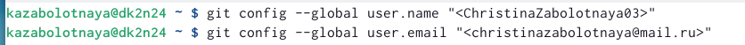{ #fig:0021 width=90% }

Описываются проведённые действия, в качестве иллюстрации даётся ссылка на иллюстрацию (рис. [-@fig:0022а])

2) Настроим utf-8 в выводе сообщений git, зададим имя начальной ветки (будем называть её master), параметр autocrlf, параметр safecrlf.

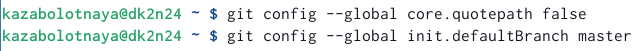{ #fig:0022а width=90% }

Описываются проведённые действия, в качестве иллюстрации даётся ссылка на иллюстрацию (рис. [-@fig:0022б])

Пункт 2 - продолжение.

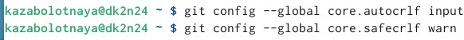{ #fig:0022б width=90% }

Описываются проведённые действия, в качестве иллюстрации даётся ссылка на иллюстрацию (рис. [-@fig:0023])

3) Для последующей идентификации пользователя на сервере репозиториев необходимо сгенерировать пару ключей (приватный и открытый).

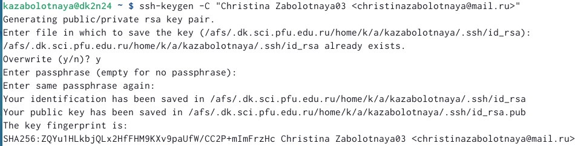{ #fig:0023 width=90% }

Описываются проведённые действия, в качестве иллюстрации даётся ссылка на иллюстрацию (рис. [-@fig:0024а])

4) Далее загрузим сгенерённый открытый ключ на сайте http://github.org/ под своей учётной записью и перейдем в меню Setting . После этого выберем в боковом меню SSH and GPG keys и нажмем кнопку New SSH key. Скопируем из локальной консоли ключ в буфер обмена. Вставляем ключ в появившееся на сайте поле и указываем для ключа имя (Title).

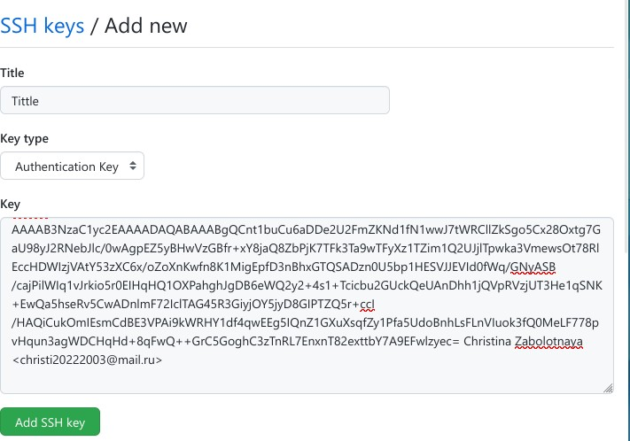{ #fig:0024а width=90% }

Описываются проведённые действия, в качестве иллюстрации даётся ссылка на иллюстрацию (рис. [-@fig:0024б])

Пункт 4 - продолжение.

{ #fig:0024б width=90% }

Описываются проведённые действия, в качестве иллюстрации даётся ссылка на иллюстрацию (рис. [-@fig:0025])

5) Создадим репозиторий, дадим ему название (study_2022–2023_arh-pc). 

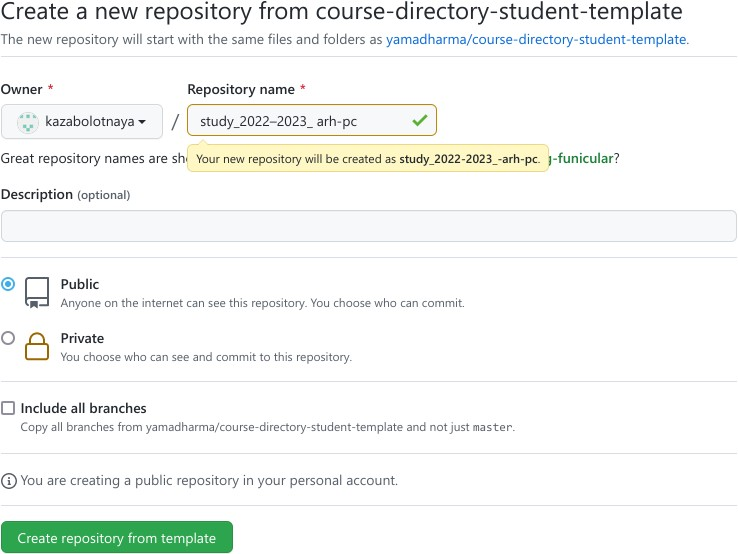{ #fig:0025 width=90% }

Описываются проведённые действия, в качестве иллюстрации даётся ссылка на иллюстрацию (рис. [-@fig:0026])

6) Откроем терминал и создадим каталог для предмета «Архитектура компьютера», перейдём в каталог курса.

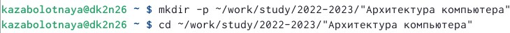{ #fig:0026 width=90% }

Описываются проведённые действия, в качестве иллюстрации даётся ссылка на иллюстрацию (рис. [-@fig:0027а])

7) Клонируем	созданный	репозиторий	(Ссылку	для клонирования скопируем на странице созданного репозитория).

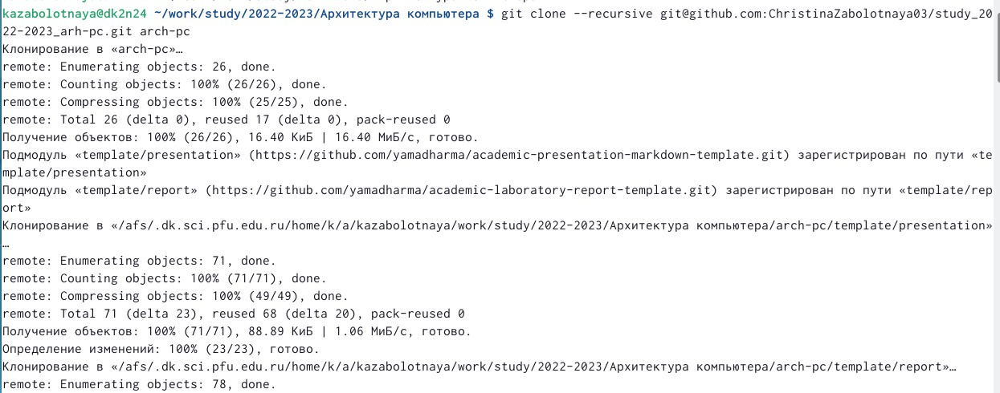{ #fig:0027а width=90% }

Описываются проведённые действия, в качестве иллюстрации даётся ссылка на иллюстрацию (рис. [-@fig:0027б])

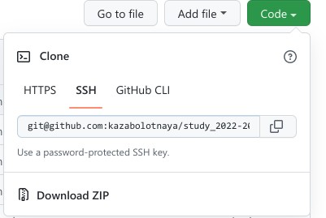{ #fig:0027б width=90% }

Описываются проведённые действия, в качестве иллюстрации даётся ссылка на иллюстрацию (рис. [-@fig:0028])

8) Перейдём в каталог курса. Удалим лишние файлы. Создадим необходимые каталоги.

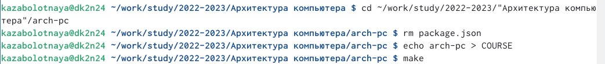{ #fig:0028 width=90% }

Описываются проведённые действия, в качестве иллюстрации даётся ссылка на иллюстрацию (рис. [-@fig:0029а])

9) Отправим файлы на сервер.

{ #fig:0029а width=90% }

Описываются проведённые действия, в качестве иллюстрации даётся ссылка на иллюстрацию (рис. [-@fig:0029б])

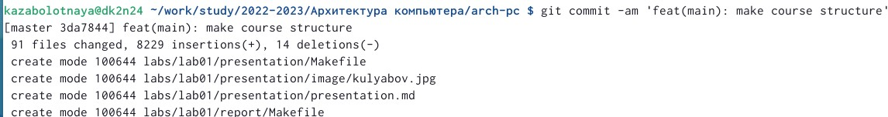{ #fig:0029б width=90% }

Описываются проведённые действия, в качестве иллюстрации даётся ссылка на иллюстрацию (рис. [-@fig:0029в])

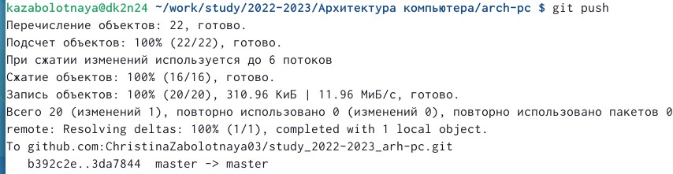{ #fig:0029в width=90% }

Описываются проведённые действия, в качестве иллюстрации даётся ссылка на иллюстрацию (рис. [-@fig:00210])

10) Отправим файлы на сервер.

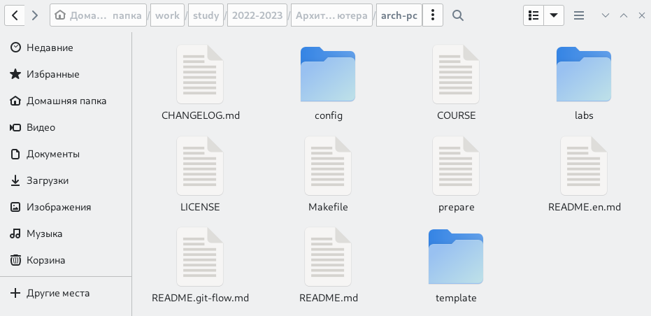{ #fig:00210 width=90% }

# Выводы

В ходе изучения данной лабораторной работы были приобретены практические навыки по работе с системой git, научились создавать репозиторий, отправлять файлы на сервер.  Изучили идеологию и применение средств контроля версий. 

# Список литературы{.unnumbered}

::: {#refs}
:::
