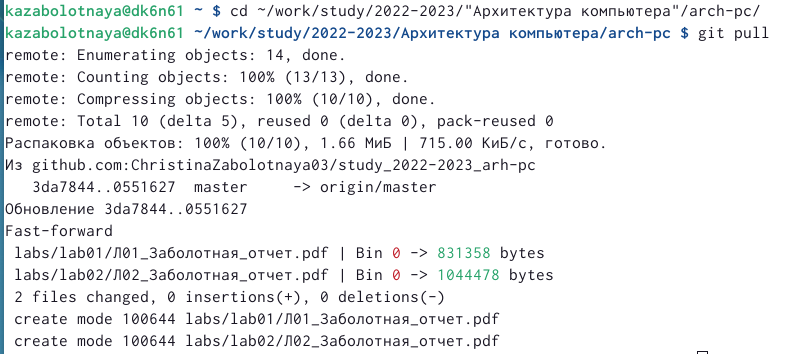
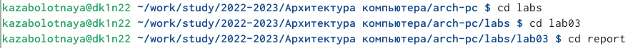
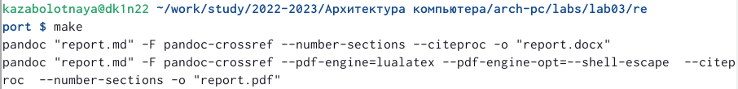
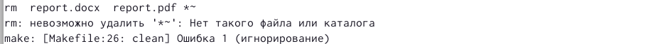
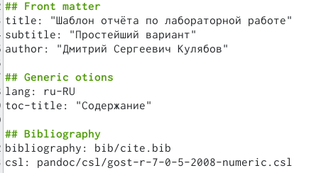
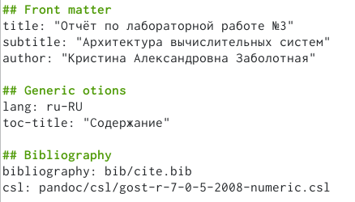
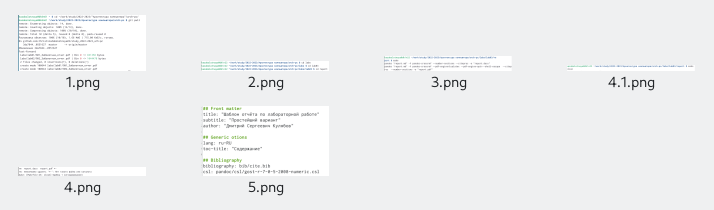

---
## Front matter
title: "Лабораторная работа №3"
subtitle: "Архитектура вычислительных систем"
author: "Заболотная Кристина Александровна"

## Generic otions
lang: ru-RU
toc-title: "Содержание"

## Bibliography
bibliography: bib/cite.bib
csl: pandoc/csl/gost-r-7-0-5-2008-numeric.csl

## Pdf output format
toc: true # Table of contents
toc-depth: 2
lof: true # List of figures
lot: true # List of tables
fontsize: 12pt
linestretch: 1.5
papersize: a4
documentclass: scrreprt
## I18n polyglossia
polyglossia-lang:
  name: russian
  options:
	- spelling=modern
	- babelshorthands=true
polyglossia-otherlangs:
  name: english
## I18n babel
babel-lang: russian
babel-otherlangs: english
## Fonts
mainfont: PT Serif
romanfont: PT Serif
sansfont: PT Sans
monofont: PT Mono
mainfontoptions: Ligatures=TeX
romanfontoptions: Ligatures=TeX
sansfontoptions: Ligatures=TeX,Scale=MatchLowercase
monofontoptions: Scale=MatchLowercase,Scale=0.9
## Biblatex
biblatex: true
biblio-style: "gost-numeric"
biblatexoptions:
  - parentracker=true
  - backend=biber
  - hyperref=auto
  - language=auto
  - autolang=other*
  - citestyle=gost-numeric
## Pandoc-crossref LaTeX customization
figureTitle: "Рис."
tableTitle: "Таблица"
listingTitle: "Листинг"
lofTitle: "Список иллюстраций"
lotTitle: "Список таблиц"
lolTitle: "Листинги"
## Misc options
indent: true
header-includes:
  - \usepackage{indentfirst}
  - \usepackage{float} # keep figures where there are in the text
  - \floatplacement{figure}{H} # keep figures where there are in the text
---

# Цель работы

Цель работы: освоить процедуры оформления отчётов с помощью легковесного языка разметки Markdownа, а также познакомиться с основными возможностями разметки Markdown.

# Задание

В соответствующем каталоге сделать отчёт по лабораторной работе № 3 в формате Markdown. В качестве отчёта предоставить отчёты в 3 форматах: pdf, docx и md. Загрузить файлы на github.

# Теоретическое введение

I. Базовые сведения о Markdown.
Чтобы создать заголовок, используйется знак #, например: # This is heading 1. 
Чтобы задать для текста полужирное начертание, надо заключить его в двойные звездочки.
Чтобы задать для текста курсивное начертание, заключите его в одинарные звездочки: This text is *italic*.
Чтобы задать для текста полужирное и курсивное начертание, заключите его
в тройные звездочки.
Блоки цитирования создаются с помощью символа >: > The drought had lasted now for ten million years.
Чтобы вложить один список в другой, надо добавить отступ для элементов дочернего списка.
Неупорядоченный (маркированный) список можно отформатировать с помощью звездочек или тире. 
Чтобы вложить один список в другой, добавим отступ для элементов дочернего списка. 
Синтаксис Markdown для встроенной ссылки состоит из части, представляющей текст гиперссылки, и части URL-адреса или имени файла, на который дается ссылка.
Markdown поддерживает как встраивание фрагментов кода в предложение, так и их размещение между предложениями в виде отдельных огражденных блоков. Огражденные блоки кода — это простой способ выделить синтаксис для фрагментов кода. 
II. Оформление формул в Markdown.
Внутритекстовые формулы делаются аналогично формулам LaTeX. 
III. Оформление изображений в Markdown.
В Markdown вставить изображение в документ можно с помощью непосредственного указания адреса изображения. 
Здесь:
• в квадратных скобках указывается подпись к изображению;
• в круглых скобках указывается URL-адрес или относительный путь изображения, а также (необязательно) всплывающую подсказку, заключённую в двойные или одиночные кавычки.
• в фигурных скобках указывается идентификатор изображения (#fig:fig1) для ссылки на него по тексту и размер изображения относительно ширины страницы (width=90%)
IV. Обработка файлов в формате Markdown.
Преобразовать файл README.md можно следующим образом:
pandoc README.md -o README.pdf
или так
pandoc README.md -o README.docx

# Выполнение лабораторной работы

Описываются проведённые действия, в качестве иллюстрации даётся ссылка на иллюстрацию (рис. [-@fig:001])

1) Откроем терминал. Перейдём в каталог курса сформированный при выполнении лабораторной работы №2. Обновим локальный репозиторий, скачав изменения из удалённого репозитория с помощью команды git pull. Ссылка на иллюстрацию (рис. [-@fig:001])

{ #fig:001 width=90% }

Описываются проведённые действия, в качестве иллюстрации даётся ссылка на иллюстрацию (рис. [-@fig:002])

2) Перейдём в каталог с шаблоном отчёта по лабораторной работе №3. Ссылка на иллюстрацию (рис. [-@fig:002])

{ #fig:002 width=90% }

Описываются проведённые действия, в качестве иллюстрации даётся ссылка на иллюстрацию (рис. [-@fig:003])

3) Проведём компиляцию шаблона с использованием Makefile. Для этого введём команду make. (При успешной компиляции должны сгенерироваться файлы report.pdf и report.docx. Проверим корректность полученных файлов.) Ссылка на иллюстрацию (рис. [-@fig:003])

{ #fig:003 width=90% }

Описываются проведённые действия, в качестве иллюстрации даётся ссылка на иллюстрацию (рис. [-@fig:004])

4) Удалим полученный файл с использованием Makefile. Для этого введём команду make clean. Проверим, что после этой команды файлы report.pdf и report.docx были удалены. Ссылка на иллюстрацию (рис. [-@fig:004])

{ #fig:004 width=90% }

Описываются проведённые действия, в качестве иллюстрации даётся ссылка на иллюстрацию (рис. [-@fig:005])

5) Откроем файл report.md c помощью любого текстового редактора, например gedit. Изучим структуру этого файла. Ссылка на иллюстрацию (рис. [-@fig:005])

{ #fig:005 width=90% }

Описываются проведённые действия, в качестве иллюстрации даётся ссылка на иллюстрацию (рис. [-@fig:006])

6) Заполним отчёт и скомпилируем отчёт с использованием Makefile. Проверим 
корректность полученных файлов. 

{ #fig:006 width=90% }

Описываются проведённые действия, в качестве иллюстрации даётся ссылка на иллюстрацию (рис. [-@fig:007])

7) Проверяем корректность полученных файлов.

{ #fig:007 width=90% }

8) Загрузим файлы на Github.

# Выводы

В ходе выполнения данной лабораторной работы были освоены процедуры оформления отчётов с помощью легковесного языка разметки Markdown, а также познакомились с основными возможностями разметки Markdown.

# Список литературы{.unnumbered}

::: {#refs}
:::
