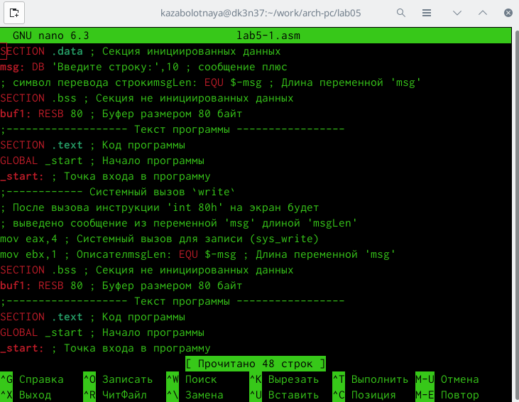

---
## Front matter
title: "Лабораторная работа №5"
subtitle: "Архитекрура вычислительных систем"
author: "Заболотная Кристина"

## Generic otions
lang: ru-RU
toc-title: "Содержание"

## Bibliography
bibliography: bib/cite.bib
csl: pandoc/csl/gost-r-7-0-5-2008-numeric.csl

## Pdf output format
toc: true # Table of contents
toc-depth: 2
lof: true # List of figures
lot: true # List of tables
fontsize: 12pt
linestretch: 1.5
papersize: a4
documentclass: scrreprt
## I18n polyglossia
polyglossia-lang:
  name: russian
  options:
	- spelling=modern
	- babelshorthands=true
polyglossia-otherlangs:
  name: english
## I18n babel
babel-lang: russian
babel-otherlangs: english
## Fonts
mainfont: PT Serif
romanfont: PT Serif
sansfont: PT Sans
monofont: PT Mono
mainfontoptions: Ligatures=TeX
romanfontoptions: Ligatures=TeX
sansfontoptions: Ligatures=TeX,Scale=MatchLowercase
monofontoptions: Scale=MatchLowercase,Scale=0.9
## Biblatex
biblatex: true
biblio-style: "gost-numeric"
biblatexoptions:
  - parentracker=true
  - backend=biber
  - hyperref=auto
  - language=auto
  - autolang=other*
  - citestyle=gost-numeric
## Pandoc-crossref LaTeX customization
figureTitle: "Рис."
tableTitle: "Таблица"
listingTitle: "Листинг"
lofTitle: "Список иллюстраций"
lotTitle: "Список таблиц"
lolTitle: "Листинги"
## Misc options
indent: true
header-includes:
  - \usepackage{indentfirst}
  - \usepackage{float} # keep figures where there are in the text
  - \floatplacement{figure}{H} # keep figures where there are in the text
---

# Цель работы

Приобретение практических навыков работы в Midnight Commander. Освоение инструкций языка ассемблера mov и int.

# Задание

1. Создать копию файла lab5-1.asm. Внести изменения в программу (без использования внешнего файла in_out.asm), так чтобы она работала по следующему алгоритму: 
• вывести приглашение типа “Введите строку:”; 
• ввести строку с клавиатуры; 
• вывести введённую строку на экран.
2. Получить исполняемый файл и проверить его работу. На приглашение ввести строку, свою фамилию.
3. Создать копию файла lab5-2.asm. Исправить текст программы с использованием подпрограмм из внешнего файла in_out.asm, так чтобы она работала по следующему алгоритму:
• вывести приглашение типа “Введите строку:”;
• ввести строку с клавиатуры;
• вывести введённую строку на экран.
Подключаемый файл in_out.asm должен лежать в том же каталоге, что и файл с программой, в которой он используется.
4. Создать исполняемый файл и проверить его работу.

# Теоретическое введение

Midnight Commander (или просто mc) — это программа, которая позволяет просматривать структуру каталогов и выполнять основные операции по управлению файловой системой, т.е. mc является файловым менеджером. Midnight Commander позволяет сделать работу с файлами более удобной и наглядной. Для активации оболочки Midnight Commander достаточно ввести в командной строке mc и нажать клавишу Enter.
Директивы используются для объявления простых переменных и для объявления массивов. Для определения строк принято использовать директиву DB в связи с особенностями хранения данных в оперативной памяти.
Простейший диалог с пользователем требует наличия двух функций — вывода текста на экран и ввода текста с клавиатуры. Простейший способ вывести строку на экран — использовать системный вызов write. Этот системный вызов имеет номер 4, поэтому перед вызовом инструкции int необходимо поместить значение 4 в регистр eax. Первым аргументом write, помещаемым в регистр ebx, задаётся дескриптор файла. Для вывода на экран в качестве дескриптора файла нужно указать 1 (это означает «стандартный вывод», т. е. вывод на экран). Вторым аргументом задаётся адрес выводимой строки (помещаем его в регистр ecx, например, инструкцией mov ecx, msg). Строка может иметь любую длину.
Последним аргументом (т.е. в регистре edx) должна задаваться максимальная длина выводимой строки.
Для ввода строки с клавиатуры можно использовать аналогичный системный вызов read. Его аргументы – такие же, как у вызова write, только для «чтения» с клавиатуры используется файловый дескриптор 0 (стандартный ввод). Системный вызов exit является обязательным в конце любой программы на языке ассемблер. Для обозначения конца программы перед вызовом инструкции int 80h необходимо поместить в регистр еах значение 1, а в регистр ebx код завершения 0.

# Выполнение лабораторной работы

1. Откроем Midnight Commander. 

{ #fig:001 width=90% }

2. Создаем директорию. 

{ #fig:002 width=90% }

3. Создаем файл lab5-1.

{ #fig:003 width=90% }

4. Вводим текст программы из листинга. 

{ #fig:004 width=90% }

5. Вводим текст программы из листинга.

{ #fig:005 width=90% }

6. Создаем файл lab5-2. 

{ #fig:006 width=90% }

7. Изменяем код в lab5-2. 

{ #fig:007 width=90% }

8. Переносим текст из заданий к лабораторной работе. 

{ #fig:008 width=90% }

9. Вводим свои ФИО, работая в lab5-2. 

{ #fig:009 width=90% }

10. В файле lab5-2.asm заменим подпрограмму sprintLF на sprint. 

{ #fig:010 width=90% }

11. В файле lab5-2.asm заменим подпрограмму sprintLF на sprint. 

{ #fig:011 width=90% }

12. Создадим исполняемый файл и проверим его работу. Посмотрим, в чем разница между sprintLF и sprint.

{ #fig:012 width=90% }

# Самостоятельная часть лабораторной работы

13. Работаем в папке lab5-3.

{ #fig:013 width=90% }

14. Получим исполняемый файл и проверим его работу. На приглашение введите строку вводим свою фамилию. 

{ #fig:014 width=90% }

15. Копируем файл lab5-2.asm.

{ #fig:015 width=90% }

16. Копируем команды mov eax, buf1; mov ecx, buf1; mov edx, 80; для выполнения команды call sprintLF. 

{ #fig:016 width=90% }

17. Оттранслируем текст программы lab5-2.asm в объектный файл. Выполним компоновку объектного файла и запустим получившийся исполняемый файл. Программа выводит строку 'Введите строку:' и ожидает ввода с клавиатуры. На запрос введем ФИО 

{ #fig:017 width=90% }

# Выводы

В ходе выполнения данной лабораторной работы были приобретены практические навыки работы в Midnight Commander. Были освоены инструкции языка ассемблера mov и int.

# Список литературы{.unnumbered}
::: {#refs}
:::
